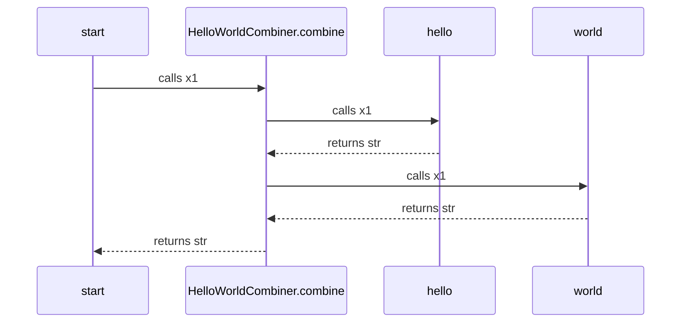

# docs-from-tests

This python package contains functions to instrument your code / tests to create sequence diagrams (in markdown / mermaid) as the tests run.  

The sequence diagrams show the runtime call hierachy of the code. They are saved as files in the repository, which you should check in. 

You can choose to ignore specific functions, and private functions, to make diagrams readable in each context you are interested in. 

The diagrams are useful documentation, and will stay up to date as they are automatically generated. Hopefully it will encourage us to have useful diagrams in the repo, with the appropriate levels of detail, which in turn will encourage us to structure the code well so it produces good diagrams, and to  have tests at these levels of detail. 

You can see an example of this package in use at [docs-from-tests-example](https://github.com/ceddlyburge/docs-from-tests-example).

## Build Status

## Usage

You can see an example of instrumenting a test at [tests\test_hello_world.py](tests\test_hello_world.py)

This test creates the following diagram 

- [doc/end-to-end-sequence-diagram.md](doc/end-to-end-sequence-diagram.md)

The diagram is reproduced here for convenience. It is a mermaid diagram, you may need to install a [Browser Plugin](https://github.com/BackMarket/github-mermaid-extension) or [VsCode extension](https://marketplace.visualstudio.com/items?itemName=bierner.markdown-mermaid) or similar to view it.

[View full screen as SVG](https://mermaid.ink/svg/c2VxdWVuY2VEaWFncmFtCiAgc3RhcnQtPj5IZWxsb1dvcmxkQ29tYmluZXIuY29tYmluZTogY2FsbHMgeDEKICBIZWxsb1dvcmxkQ29tYmluZXIuY29tYmluZS0+PmhlbGxvOiBjYWxscyB4MQogIGhlbGxvLS0+PkhlbGxvV29ybGRDb21iaW5lci5jb21iaW5lOiByZXR1cm5zIHN0cgogIEhlbGxvV29ybGRDb21iaW5lci5jb21iaW5lLT4+d29ybGQ6IGNhbGxzIHgxCiAgd29ybGQtLT4+SGVsbG9Xb3JsZENvbWJpbmVyLmNvbWJpbmU6IHJldHVybnMgc3RyCiAgSGVsbG9Xb3JsZENvbWJpbmVyLmNvbWJpbmUtLT4+c3RhcnQ6IHJldHVybnMgc3RyCg==)        

## Running tests

- use python>=3.7
- `pip install requirements.txt`
- `set pythonpath=<path to root of this repo>`
- `pytest`

## Contributing

- Use [PEP-0008](https://www.python.org/dev/peps/pep-0008/)
- Please open up an Issue for new work, where any discussion can take place, and then submit a pull request to fix the issue.

## Project Champion

The champion for this a repo is [Cedd Burge](cedd.burge@res-group.com) who is accountable for:

- The usability of the repo, and ensuring user guides and READMEs are up to date
- The code quality of the repo (CODEOWNERS, pull requests, tests, and builds all help here)
- The usability of the code for other developers (retrospectives, code quality, architecture, and documentation all help here)