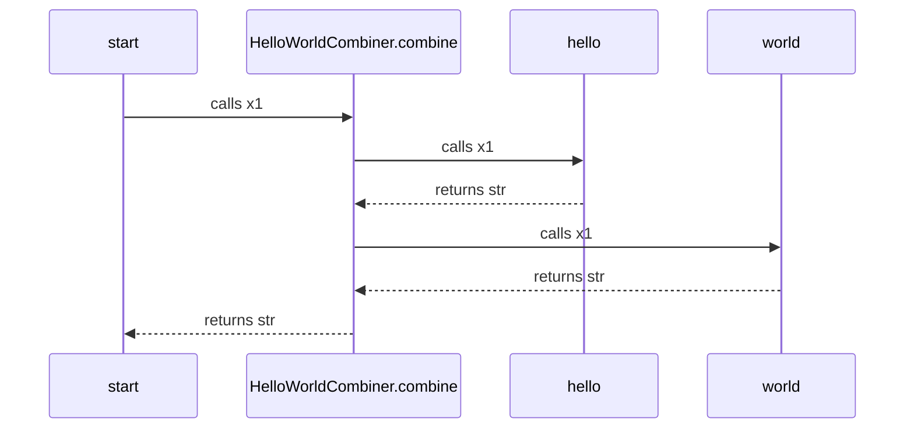

This is a mermaid diagram, you may need to install a [Browser Plugin](https://github.com/BackMarket/github-mermaid-extension) or [VsCode extension](https://marketplace.visualstudio.com/items?itemName=bierner.markdown-mermaid) or similar to view it.

You can also [view it full screen as an SVG](https://mermaid.ink/svg/c2VxdWVuY2VEaWFncmFtCiAgc3RhcnQtPj5IZWxsb1dvcmxkQ29tYmluZXIuY29tYmluZTogY2FsbHMgeDEKICBIZWxsb1dvcmxkQ29tYmluZXIuY29tYmluZS0+PmhlbGxvOiBjYWxscyB4MQogIGhlbGxvLS0+PkhlbGxvV29ybGRDb21iaW5lci5jb21iaW5lOiByZXR1cm5zIHN0cgogIEhlbGxvV29ybGRDb21iaW5lci5jb21iaW5lLT4+d29ybGQ6IGNhbGxzIHgxCiAgd29ybGQtLT4+SGVsbG9Xb3JsZENvbWJpbmVyLmNvbWJpbmU6IHJldHVybnMgc3RyCiAgSGVsbG9Xb3JsZENvbWJpbmVyLmNvbWJpbmUtLT4+c3RhcnQ6IHJldHVybnMgc3RyCg==)        

